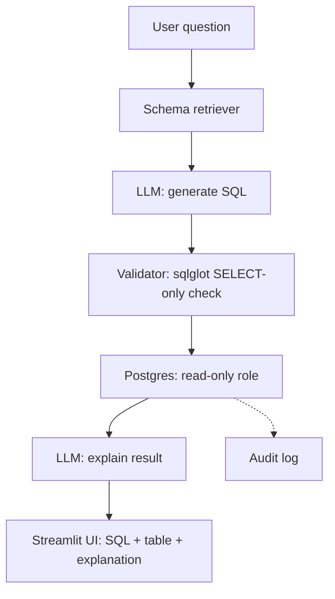

# 🏦 Bank NL-to-SQL Assistant

Ask questions about banking data in plain English — get real SQL, real results, and a plain-English answer back. Built as a portfolio project demonstrating SQL + AI + safety-conscious engineering for a banking context.

## How it works

## Stack
- **Database:** PostgreSQL, synthetic banking data (customers, accounts, transactions, loans)
- **LLM:** Google Gemini API
- **Validation:** sqlglot (blocks anything that isn't a SELECT)
- **Frontend:** Streamlit
- **Safety:** dedicated read-only DB role + SQL validation + audit logging

## Setup
1. Clone this repo
2. `python -m venv venv` and activate it
3. `pip install -r requirements.txt`
4. Create a `.env` file with `DB_HOST`, `DB_PORT`, `DB_NAME`, `DB_USER`, `DB_PASSWORD`, `GEMINI_API_KEY`
5. Run `schema.sql` against your database
6. `python generate_data.py` to populate synthetic data
7. `streamlit run app.py`

## Example
**Question:** "What's the total value of transactions flagged as high-risk in the last 30 days?"
**Generated SQL:** `SELECT SUM(amount) FROM transactions WHERE risk_flag = 'high' AND transaction_time >= NOW() - INTERVAL '30 days';`
**Answer:** "Over the past 30 days, high-risk transactions totaled $X."

## Evaluation results
Tested against 21 hand-written questions spanning filtering, joins, aggregation, negation, and ambiguity: **~81% fully correct.**

Known failure patterns:
- Assumes columns exist when asked about data not in the schema (e.g. credit score), returning NULL instead of clearly stating the data doesn't exist
- Occasionally mis-assumes boolean types for text flag columns unless the schema description is explicit
- Ambiguous questions ("top customers", "how much they've saved") get answered with a reasonable but unstated assumption rather than a clarifying question

## Limitations & what I'd add next
- No conversation memory (each question is independent)
- No confidence scoring or clarification step for ambiguous questions
- Read-only role is connection-level, not row/column-level (no PII masking implemented, though the design allows for it)
- Evaluation set is 21 questions, not a full benchmark